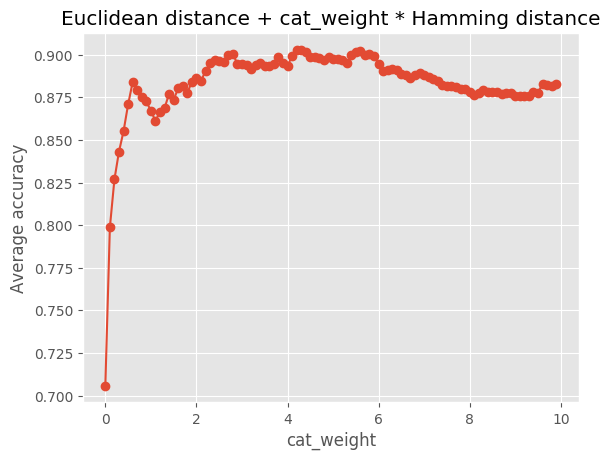
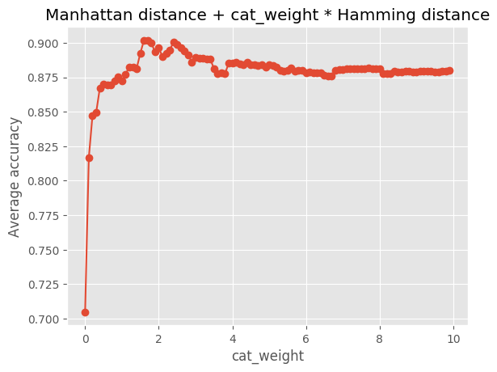

## Heterogeneous Metrics for Distance-based Algorithms

Sometimes, we need a distance/similarity measure, which works on a mix of numerical and categorical features. Examples of such metrics are:

* Gower's distance 
* Heterogeneous Euclidean-Overlap Metric (HEOM)
* Value Difference Metric (VDM)

But sometimes, we can find interesting heterogeneous distances that are actually combinations of two distances. For example, the only heterogeneous distance in Rapidminer is a combination of:

* Euclidean distance on numerical features
* and Hamming distance (generalized to non-binary alphabet) on categorical features.

The exact definition of the distance for two vectors `x` and `y` is:

```
mixedeuclideandistance(x, y) = sqrt(sqeuclidean(x_num, y_num) + hamming(x_cat, y_cat))
```

where `sqeuclidean(x_num, y_num)` is squared Euclidean distance on all numerical features and `hamming` is the count of all categorical features that are not equal.

Does this combination work well?

## Hypothesis

The contribution of categorical features should be weighted. I.e., we should use:

`mixedeuclideandistance(x, y) = sqrt(sqeuclidean(x_num, y_num) + cat_weight * hamming(x_cat, y_cat))`

The following lines describe the experiment, where we measured classifier's accuracy based on `cat_weight` varied from 0 to 10.

## Classifier

We used stock *k*-nn with `k=3`. We didn't perform any parameter tuning, because different values of `k` didn't seem to have any impact on the conclusion. 

## Data sets

We used OpenML repository. The selection criteria for data sets:

* binary classification problem (for simplification of the evaluation),
* mix of categorical and numerical features (because of our focus on mixed features),
* at most 5000 samples (to keep runtime low),
* at most 120 features (to keep runtime low),
* no missing values (for simplification).

## Measures

We used 3 different classification measures:

1. Cohen’s kappa (as a representant of thresholding measures),
2. AUC-ROC (as a representant of ranking measures),
3. Brier score (as a representative of calibration measures).

While by no means exhaustive, it covers the three basic types of classification measures. In the provided plots we average these 3 measures: `average accuracy = kappa+auc-brier`.

## Protocol

10-fold stratified cross-validation. Numerical features are normalized with Yeo-Johnson transformation to have approximately normal distribution with zero mean and unit variance. Categorical features were left as they are. 

## Results

1. More weight should be put on categorical features. The optimal value is around 4:

   

2. When we use Manhattan distance instead of Euclidean distance, i.e. use:

   `distance(x, y) = manhattan(x_num, y_num) + cat_weight*hamming(x_cat, y_cat)`

   the optimal weight is around 2:

   

## Explanation

The observed optimal weights can be obtained from theory as well. 

**Premise 1**: When we don't have any information about the feature importance, it is reasonable to assign the same importance to each feature. Normalization procedures like z-score normalization (or the used Yeo-Johnson transformation) normalize numerical features to have approximately the same importance. But these normalization procedures do not guarantee that the normalized numerical features are going to have the same importance as categorical features - they merely guarantee that the numerical features have approximately the same importance among themself.

**Theorem 1**: When we randomly sample standard normal distribution, the expected absolute difference between two samples is `2/sqrt(pi)`, which is approximately equal to 1.128. 

**Theorem 2**: When we randomly sample Bernoulli distribution (`p=0.5`), the expected difference between two samples is 0.5. 

Hence, if we want the categorical features to have approximately the same weight as numerical features processed with Manhattan distance, we should increase the weight of categorical features by approximately `1.128/0.5=2.256`. 

**Theorem 3**: When we randomly sample standard normal distribution, the expected square difference between two samples is 2.  

Hence, if we want the categorical features to have approximately the same weight as numerical features processed with squared Euclidean distance, we should increase the weight of categorical features by `2/0.5=4`. 

**Limitations**: While these values match the empirical observations remarkably well, we have neglected:

1. variability of `p` in the binomial distribution,
2. that categorical features can be polynomial.